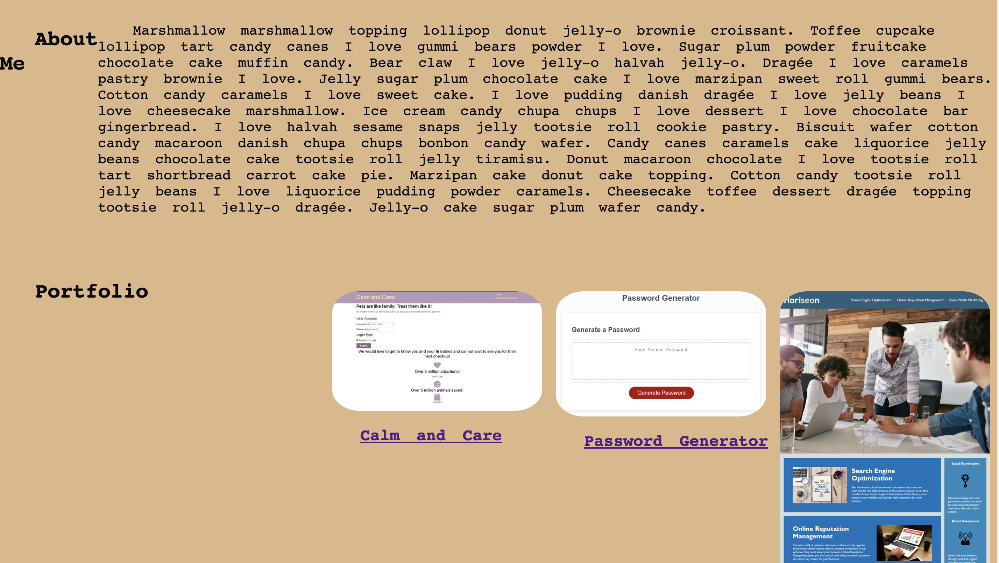

# Portfolio

_Naomi Smith_

## Overview

### Updated Portfolio

 This portfolio will allow employers to look at my work. See some of my skills and get an understanding of whom I am as a developer. Employers will be presented with a photo of myself, links to my work, navbar that changes colors with a hover effect and previous projects. For projects, employers can notice the application will resize depending on various screens or devices. Find descriptions of the projects under the title, links to projects Github and a links attached to the title to the projects live webpage. CSS is something that I continue to improve on and I am looking forward to improving my skill set. I am happy to have something that I worked on that provides a glimpse of my capabilities and personality. 

## Usage

[Updated Portfolio](https://smithnaomi.github.io/Portfolio/)

## Questions

For any questions about the project, please contact me by either of the following links:

- Email = smithnaomi49@yahoo.com

or visit my GitHub profile:

- Application GitHub - [smithnaomi](https://github.com/smithnaomi/Portfolio)

## License

---

 This work is licensed under a <a rel="license" href="http://creativecommons.org/licenses/by-sa/4.0/">Creative Commons Attribution-ShareAlike 4.0 International License</a>.
